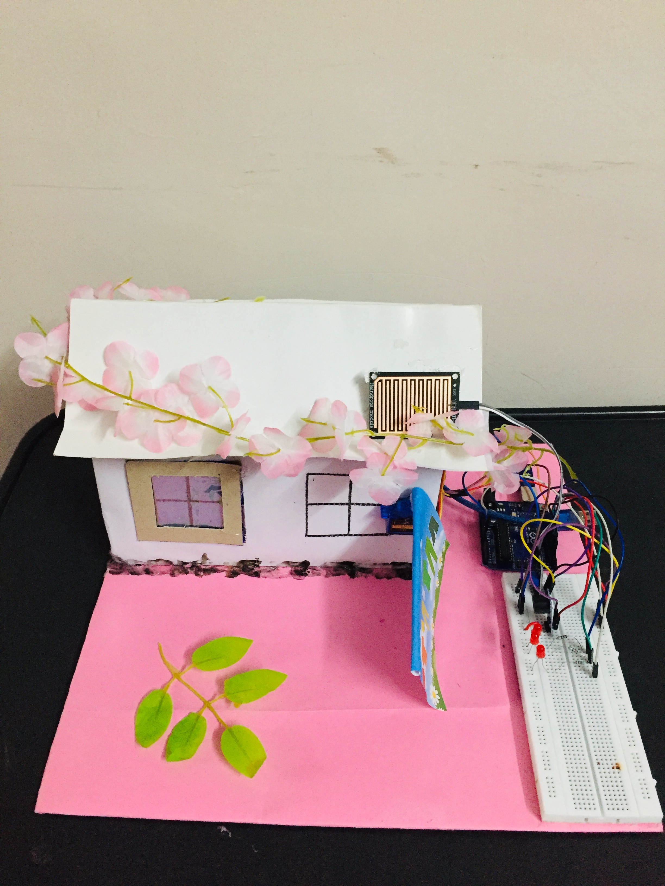
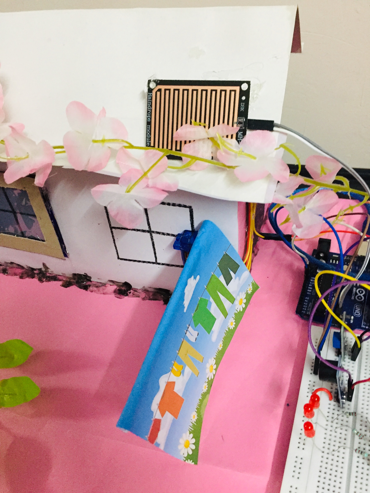
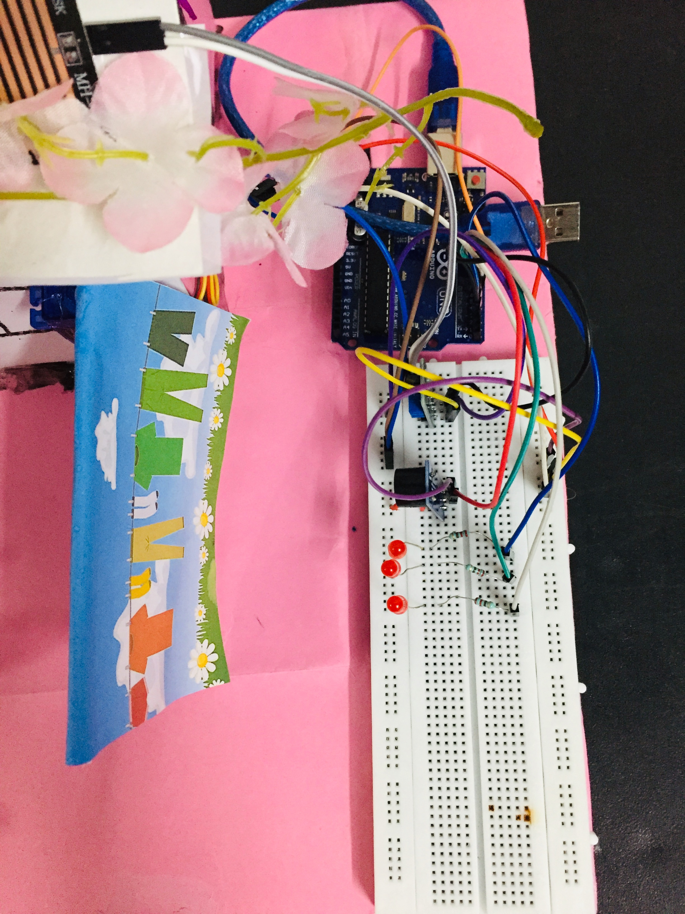
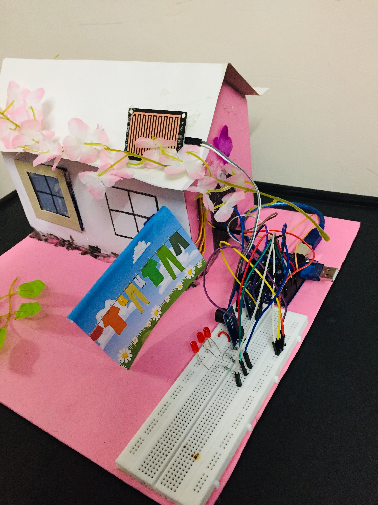

# 🌧️ Automatic Rain Detector & Clothes Protection System

This project is designed to automatically protect clothes from unexpected rainfall using simple yet effective components. The system primarily consists of an Arduino Uno, a rain sensor, a servo motor, and alert mechanisms like LEDs and a buzzer.

🎥 **Project Demo Video:**  
https://www.linkedin.com/posts/miraribadiya_arduino-iot-automation-activity-7362853620452659201-iici

**images**

##  Project Overview
This project is designed to automatically protect clothes from unexpected rainfall.  
When rain is detected, the system activates a servo motor to move the clothes to a safe position and alerts the user using LEDs and a buzzer.  
The project is built using Arduino Uno and basic electronic components.

## ⚙️ Technologies Used
- Arduino Uno  
- Rain Sensor Module  
- Servo Motor  
- LEDs  
- Buzzer  
- Breadboard  
- Jumper Wires  
- Arduino IDE  
- Embedded C / C++

##  Features
- Automatic rain detection  
- Servo motor based clothes protection  
- Buzzer alert on rain detection  
- LED indication  
- Automatic reset when rain stops  
- Low cost and easy to implement  

##  How to Run Project
1. Connect all components as per the circuit
2. Open Arduino IDE
3. Connect Arduino Uno using USB cable
4. Upload the provided Arduino code
5. Place rain sensor in open area
6. Pour water on sensor to test the system

## 🔌 Components Connection
- Rain Sensor → Digital Pin 2  
- Servo Motor → Digital Pin 9  
- Buzzer → Digital Pin 8  
- LED 1 → Digital Pin 3  
- LED 2 → Digital Pin 4  
- LED 3 → Digital Pin 5  

##  Working
- Rain sensor detects water and sends signal to Arduino  
- Arduino rotates servo motor to protect clothes  
- LEDs glow one by one  
- Buzzer gives alert sound  
- System resets automatically when rain stops  

##  Project Images
Images are included in the repository for better understanding of the hardware setup.

##  Author
**Mira Ribadiya**  
Arduino & Embedded Systems Project
